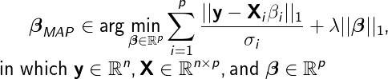
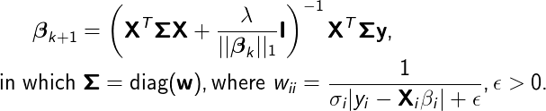

lad
===
|ci-badge| |cov-badge| |zenodo-badge|

.. |ci-badge| image:: https://travis-ci.org/mirca/lad.svg?branch=master
    :target: https://travis-ci.org/mirca/lad
.. |cov-badge| image:: https://codecov.io/gh/mirca/lad/branch/master/graph/badge.svg
    :target: https://codecov.io/gh/mirca/lad/branch/master/
.. |zenodo-badge| image:: https://zenodo.org/badge/136721899.svg
   :target: https://zenodo.org/badge/latestdoi/136721899

Least absolute deviations with L1 regularization using majorization-minimization.
In estimation theory terms, this is the Maximum A Posterior (MAP) estimator for
a Laplacian likelihood with Laplacian prior, i.e.

The MM algorithm update turns out to be

which belongs to the class of iterative reweighted least-squares: https://en.wikipedia.org/wiki/Iteratively_reweighted_least_squares

Python Version
--------------

To install the development version, proceed as follows::

    git clone https://github.com/mirca/lad.git
    pip install -e lad

Or install the lastest version on PyPi::

    pip install lad

Installation dependencies::

    - tensorflow

Test dependencies::

    - numpy
    - tensorflow
    - pytest
    - pytest-cov

R version (work in progress)
----------------------------

To install the development version, proceed as follows::

    git clone https://github.com/mirca/lad.git

Inside the R console (or your favourite terminal), type::

    install.packages("devtools") # you haven't installed devtools already
    install_github("mirca/lad")

The R version depends on the package ``CVXR`` which can be installed as follows::

    install_github("anqif/CVXR")
